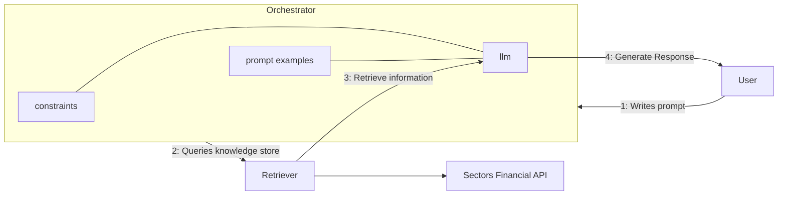

# Recipe 01 — Generative AI for Finance

> Source: https://docs.sectors.app/recipes/generative-ai-python/01-background
> Author: Samuel Chan · August 1, 2024
> Verified: 29 Aug 2026

## Goal

Explain why **Retrieval-Augmented Generation (RAG)** is the right pattern for finance LLMs on top of Sectors data, and why off-the-shelf general-purpose LLMs fail for the same use case.

This chapter is **conceptual** — no code. It sets up the motivation for chapters 2–6 (tool-use RAG → multi-agent → structured output → ReAct → memory).

---

## Architecture diagram

Three components, all wired by an orchestrator (LangChain in the Sectors examples, but the pattern is framework-agnostic):

| Component | Role | Sectors-specifics |
|-----------|------|-------------------|
| **Orchestrator** | Receives the user query, decides which tool to call, passes the result back to the LLM. | Any framework that supports tool use — LangChain, OpenAI Agents SDK, Claude Tool Use, raw OpenAI function calling. |
| **Retriever** | Wraps the Sectors API. Each `tool` function = one endpoint. | Thin Python `@tool` wrappers around `requests.get(https://api.sectors.app/v2/...)`. |
| **LLM** | Generates the natural-language answer grounded in retrieved facts. | A model fine-tuned for tool use (Llama 3 Groq tool-use, GPT-4o, Claude, DeepSeek-V3.1, etc.). |

---

## What Generative AI / LLMs are, in finance terms

**Generative AI** is a subset of AI that creates new, original content by learning from existing data — vs. conventional AI which predicts or classifies.

**Large Language Models (LLMs)** are a popular generative-AI subset trained on huge text corpora (books, articles, websites, forums). They generate human-sounding text. Some are multimodal (text + images + audio).

### Four immediate use cases in finance

| # | Use case | What the LLM does |
|---|----------|-------------------|
| 1 | **Financial data summarization** | Reads a 200-page annual report → 3-paragraph summary with the key trends |
| 2 | **Natural-language → SQL / API queries** | "Top 5 banks by market cap" → correct `where=` filter on `/v2/companies/` |
| 3 | **Logical reasoning engines** | "Why is BBCA's P/E elevated?" → chain-of-thought that cites interest rates, growth, sector comps |
| 4 | **Conversational advisory** | Multi-turn chatbot that knows your portfolio and the latest Sectors data |

---

## Why general-purpose LLMs fail at finance (verbatim from the source)

> "LLMs' problems come down to four:
> - LLM training data tends to be out-of-date (ChatGPT's knowledge cutoff is on January 2022).
> - LLMs extrapolate with generic information when facts aren't available, confidently making false but plausible-sounding statements when there's a gap in their knowledge.
> - Incorporation of actual financial data in the training process might be limited due to confidentiality concerns, and the model's ability to interact with uploaded financial data also poses a security risk.
> - Generating inaccurate responses due to terminology confusion (we'll see an example below regarding the abbreviation 'p.e'), or presenting generic information where users expect financial-specific, current information."

The source illustrates with a literal ChatGPT 4o response to "What does P.E. stand for?": five possible meanings, only one of which (Price-to-Earnings) is financial. **A specialist model or RAG system would give only the financial answer.**

### Why fine-tuning doesn't fully fix it

| Approach | Disadvantage |
|----------|--------------|
| **Incremental training** of a base LLM on finance data | Computationally expensive; model becomes rigid, needs continuous retraining to stay current |
| **Domain-specific LLM from scratch** (BloombergGPT-style) | Hundreds of millions of $; 363B-token datasets; inflexibility to new markets |
| **RAG with an API knowledge store** | Reliable, up-to-date, controllable — **but requires a well-designed knowledge store and orchestrator** |

---

## What RAG solves

> "Retrieval Augmented Generation (RAG) refers to a set of strategy that address LLM hallucinations and the aforementioned knowledge cutoff problem by augmenting the model with an information retrieval system. By pairing the typical generative capabilities of an LLM with a retrieval system and calibrated system prompts, the LLM model are able to generate responses using precise, up-to-date information retrieved from an external knowledge store."

### RAG architecture for finance (Sectors-specific)

**Why this beats fine-tuning for Sectors:**

| | RAG | Fine-tune |
|---|-----|-----------|
| Data freshness | Live API calls | Stale until next training run |
| Cost | Pay per call, no training | $$$ GPU time |
| Control | Can forbid certain topics via prompts | Baked into weights |
| Hallucination risk | Low (grounded in returned JSON) | Medium (training data may be out of date) |
| Security | API key stays server-side | Sensitive data may enter training corpus |
| Hackathon budget | $0 in compute (just API credits) | $$$ |

---

## Inputs / outputs

| | Type | Notes |
|---|------|-------|
| **Input** | User natural-language query (free text) | Optionally multi-turn |
| **Output** | Natural-language answer grounded in Sectors API JSON | Plus intermediate tool calls in the trace |
| **Side effects** | None — read-only | All Sectors endpoints in this recipe are GET |

---

## Hackathon applicability

| Track | How this applies |
|-------|------------------|
| **AI Agents & Assistants** | The whole series is your reference architecture. RAG is the backbone of every Track 1 entry. |
| **Automation & Workflows** | RAG powers the analysis step inside a recurring workflow (cron → fetch → summarize → push to Slack). |
| **Market Intelligence** | A specialized RAG that always grounds its claims in Sectors data — judges will check for grounding. |

---

## Pitfalls

1. **Don't ship a bare LLM.** Even with a great system prompt, an LLM without retrieval will hallucinate numbers ("BBCA's P/E is 47" — might be true today, false tomorrow). Always route through Sectors.
2. **Don't dump the whole API into the prompt.** Select sections (`sections=overview,valuation,dividend`) and use bracket notation (`where=revenue[2024] > 1e12`) to keep tokens down. See [mcp/tools.md](../mcp/tools.md) and [mcp/setup.md](../mcp/setup.md).
3. **Don't trust the LLM's own numbers.** When the model claims "P/E 22.5", force it to cite the tool call it used. Verifiable claims are what the judges reward.
4. **Section selector ≠ bandwidth.** `sections=` reduces **response** size, not **call** size. It still costs a credit. Cache aggressively on universe feeds.
5. **Knowledge cutoff isn't solved by RAG alone.** RAG fixes freshness, but the **model** still has a knowledge cutoff for *reasoning style* and *terminology*. Pick a recent, finance-comfortable base model (Claude, GPT-4o, DeepSeek-V3.1, Llama 3.3 70B).

---

## Quick TL;DR

If you only remember three things from this chapter:

1. **General-purpose LLMs hallucinate finance data** — even when they sound confident.
2. **RAG = LLM + retrieval tool** — the model grounds its answers in live API responses.
3. **Sectors API is the retrieval layer** — it's your single source of truth for IDX/SGX/KLSE/Mining.

The rest of this series is "how to wire it up" with code.

---

## Up next

- [02-tool-use-rag.md](./02-tool-use-rag.md) — build your first LangChain ReAct agent over Sectors
- [03-multiagent.md](./03-multiagent.md) — specialize into multiple agents with the OpenAI Agents SDK
- [04-structured-output.md](./04-structured-output.md) — constrain LLM output with Pydantic / JSON schema
- [05-react-conversational.md](./05-react-conversational.md) — streaming ReAct with LangGraph
- [06-memory-agents.md](./06-memory-agents.md) — give your agent conversational memory
