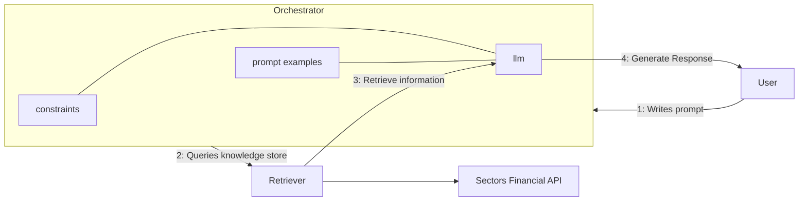

# Recipe 02 — Tool-Use RAG with Sectors Financial API

> Source: <https://docs.sectors.app/recipes/generative-ai-python/02-tool-use>
> By: Samuel Chan · August 1, 2024

## What this chapter teaches

Practical guide to building a Retrieval-Augmented Generation (RAG) system that uses **function calling** (tool-use) to fetch financial data from Sectors API on demand and feed it into the LLM's response.

## Why this matters for our hackathon

The Sectors MCP server gives us 65+ tools out of the box, but if you're building a **non-MCP agent** (e.g. using OpenAI's function-calling directly, Anthropic's tool-use API, or LangChain's `@tool` decorator), this pattern shows the raw mechanics. Useful when:
- You're using an LLM provider that doesn't speak MCP
- You need fine-grained control over which endpoints are exposed
- You want to add custom post-processing between fetch and LLM

## Architecture (mermaid)



## Pattern

1. **Orchestrator** — LangChain `AgentExecutor` taking user input, dispatching to retriever + LLM.
2. **Retriever** — Python functions wrapping `https://api.sectors.app/v2/...` endpoints. Decides which tool to call based on user's query.
3. **LLM** — A tool-use-finetuned model (recipe uses `llama-3-groq-70b-8192-tool-use-preview`; modern alternative: `openai/gpt-oss-120b`).

## Code skeleton

```python
import os, json, requests
from dotenv import load_dotenv

load_dotenv()
SECTORS_API_KEY = os.getenv("SECTORS_API_KEY")

def retrieve_from_endpoint(url: str) -> dict:
    headers = {"Authorization": SECTORS_API_KEY}
    r = requests.get(url, headers=headers)
    r.raise_for_status()
    return r.json()

# Wrap a Sectors endpoint as a tool
def get_company_overview(stock: str, section: str = "overview") -> dict:
    """Get IDX company overview section."""
    return retrieve_from_endpoint(
        f"https://api.sectors.app/v2/company/report/{stock}/?sections={section}"
    )
```

## Modernization notes (post-2024)

- `llama-3-groq-70b-8192-tool-use-preview` is **no longer available**. Use `openai/gpt-oss-120b` or `groq/compound-mini` instead.
- `langchain.agents.AgentExecutor` is **deprecated**. Use `langgraph.prebuilt.create_react_agent` (covered in chapter 05).
- For Anthropic Claude: use the native `tools=` parameter in `messages.create()` instead of LangChain.
- For OpenAI: same pattern, `tools=[{type: "function", function: {...}}]`.

## Hackathon applicability

- **AI Agents & Assistants track (primary)** — this is the core pattern for any agent product.
- **Market Intelligence** — if your screener needs natural-language input ("show me coal companies with revenue > X"), wrap the screener as a tool.
- **Automation** — less applicable (the workflow runs once per user input, not on a schedule).

## Pitfalls

- **Latency** — each tool call is one HTTP round-trip; multi-step queries can take 5-10s.
- **Credit cost** — each tool call = 1 API credit. Cache aggressively (e.g. 24h TTL on overview data).
- **Ticker format** — `get_company_overview("BBCA")` not `get_company_overview("BBCA.JK")`.
- **Error propagation** — `requests.exceptions.HTTPError` should bubble up to the agent's retry loop.

## See also

- Recipe 03 (Multi-Agent) — adds judge-critic pattern on top of this RAG base.
- Recipe 04 (Structured Output) — adds Pydantic schema validation.
- Recipe 05 (ReAct + Streaming) — LangGraph migration of this same pattern.
- `references/mcp/setup.md` — pre-built MCP alternative to writing your own tool wrappers.
