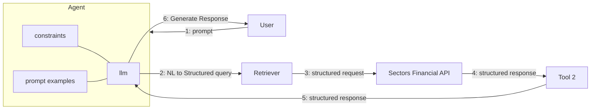

# Recipe 04 — Structured Output with Tool-Use LLMs

> Source: <https://docs.sectors.app/recipes/generative-ai-python/04-structured-output>
> By: Samuel Chan · October 1, 2024

## What this chapter teaches

Schema-aware RAG: how to enforce **structured output** from LLMs (JSON, Pydantic models) so downstream tools and data pipelines can reliably consume the results.

## Why structured output matters

Without schema constraints, LLMs return free-text. With structured output:
- Downstream tools can parse responses reliably
- Trading tools, database inserts, and report generators can consume LLM output directly
- Less "fence-stripping" boilerplate (`{"results": ...}` wrapped in ```json)

## Architecture



## Pydantic schema pattern

```python
from pydantic import BaseModel, Field
from typing import List

class CompanyExtract(BaseModel):
    ticker: str = Field(description="Bare IDX ticker, no .JK suffix")
    company_name: str
    market_cap_billions_usd: float = Field(ge=0, description="USD billions, never negative")
```

## Three enforcement mechanisms

### 1. OpenAI `response_format={"type": "json_object"}`

```python
from openai import OpenAI

client = OpenAI()
response = client.chat.completions.create(
    model="gpt-4o",
    messages=[
        {"role": "system", "content": "Return JSON with fields {ticker, company_name, market_cap_billions_usd}"},
        {"role": "user", "content": user_query},
    ],
    response_format={"type": "json_object"},
)
data = json.loads(response.choices[0].message.content)
assert data["market_cap_billions_usd"] > 0, "Negative market cap rejected"
```

### 2. Pydantic + LangChain `PydanticOutputParser`

```python
from langchain_core.output_parsers import PydanticOutputParser
from langchain_core.prompts import PromptTemplate

parser = PydanticOutputParser(pydantic_object=CompanyExtract)
prompt = PromptTemplate(
    template="Extract company info.\n{format_instructions}\n{query}",
    input_variables=["query"],
    partial_variables={"format_instructions": parser.get_format_instructions()},
)
chain = prompt | llm | parser
result = chain.invoke({"query": user_query})
```

### 3. Anthropic / Groq tool-calling (most reliable)

Define a "submit_extract" tool with the Pydantic schema as input, force the LLM to call it.

## Hackathon applicability

- **AI Agents & Assistants (primary)** — your agent's outputs become reliable enough to feed into charts, databases, and reports.
- **Market Intelligence** — essential for screeners that need structured JSON for ranking.
- **Automation** — if your automation has any LLM steps (e.g. classify news sentiment), structured output makes it auditable.

## Common pitfalls

- **Markdown fences** — even with `response_format`, LLMs sometimes return `\`\`\`json\n{...}\n\`\`\``. Add `model_kwargs={"response_format": {"type": "json_object"}}` AND strip fences as defensive parsing.
- **Big decimals in scientific notation** — `1.5e12` instead of `1500000000000`. Coerce explicitly.
- **Negative numbers as valid** — market cap shouldn't be negative. Use Pydantic's `Field(ge=0)` to enforce.
- **Optional vs required** — if a field might be missing, use `Optional[str] = None` not just `str`.

## See also

- `references/recipes/03-multiagent.md` — multi-agent pattern with structured JSON between agents.
- `references/cookbook/04-structured-output.md` (will exist) — full Pydantic walkthrough with Sectors data.
- `references/mcp/setup.md` — MCP server returns pre-structured JSON, eliminating most parsing concerns.
