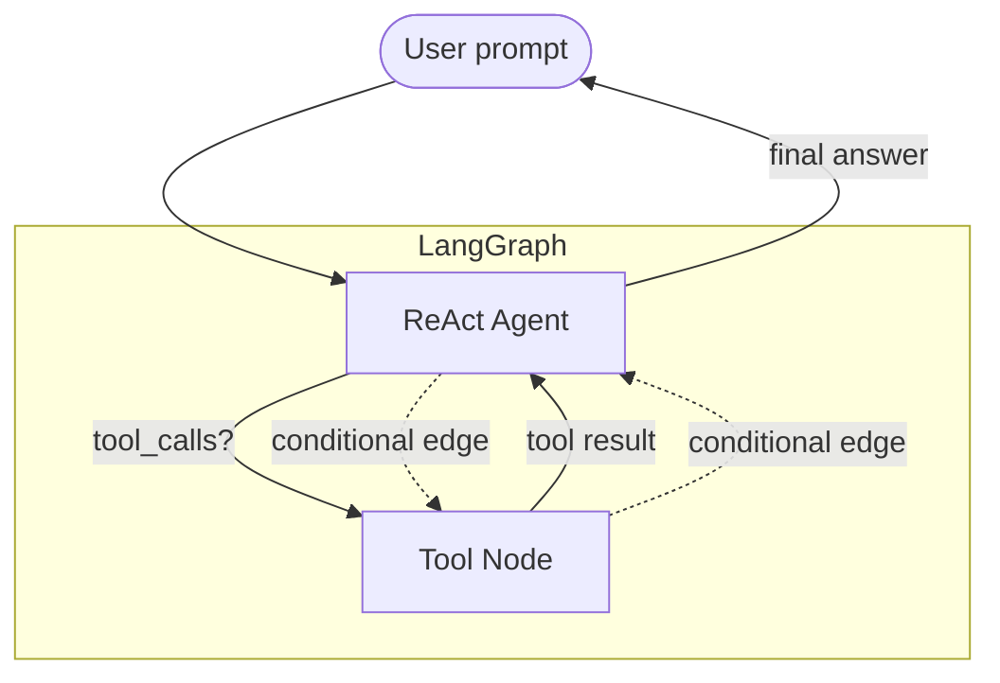
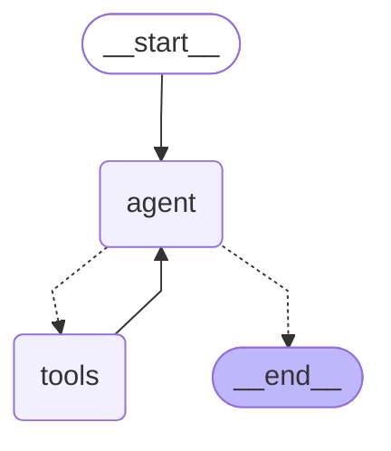

# Recipe 05 — Tool-Use ReAct Agents with Streaming

> Source: https://docs.sectors.app/recipes/generative-ai-python/05-conversational
> Author: Samuel Chan · October 10, 2024 (LangChain 0.3.2, updated for `create_react_agent`)
> Verified: 29 Aug 2026

## Goal

Replace `AgentExecutor` with LangGraph's **`create_react_agent`** — the currently recommended pattern for tool-use agents in LangChain. Adds **streaming** so long agent loops feel responsive in a UI.

This is the modern pattern Track 1 agents should use in 2026.

---

## Architecture diagram



The ReAct loop is a tiny graph with two nodes (`agent`, `tools`) and conditional edges:
1. User sends a message.
2. `agent` node decides whether to call a tool or return a final answer.
3. If tool → `tools` node runs the tool → back to `agent`.
4. If final answer → return to user.

### Mermaid of the compiled graph



---

## Why LangGraph ReAct, not `AgentExecutor`

> "As of LangChain 0.3.0 ... its official documentation now recommends the use of `ReAct` agents instead."

| | `AgentExecutor` (legacy) | `create_react_agent` (LangGraph) |
|---|---|---|
| Status | Available but legacy-preferred | Recommended in 0.3+ |
| Streaming | Awkward — partial tool calls | First-class via `.stream()` |
| Custom routing | Hard | Easy (you write the graph) |
| Persistence | External | Built-in via `checkpointer=` |
| Visualization | None | `app.get_graph().draw_mermaid_png()` |

---

## Inputs / outputs

| | Type |
|---|------|
| **Input** | `{"messages": "..."}` or `{"messages": [HumanMessage(...)]}` |
| **Output** | `{"messages": [HumanMessage, AIMessage, ToolMessage, AIMessage, ...]}` — last `AIMessage.content` is the answer |
| **Side effects** | Read-only — GET requests only |
| **Streaming** | Yes — see "Streaming" section below |

---

## Step-by-step code walkthrough

### Install

```bash
pip install langgraph
```

### Step 0 — Retriever helper

Same as [02-tool-use-rag.md](./02-tool-use-rag.md):

```python
import os, json, requests
from dotenv import load_dotenv

load_dotenv()
GROQ_API_KEY = os.getenv("GROQ_API_KEY")
SECTORS_API_KEY = os.getenv("SECTORS_API_KEY")

def retrieve_from_endpoint(url: str) -> dict:
    headers = {"Authorization": SECTORS_API_KEY}
    response = requests.get(url, headers=headers)
    response.raise_for_status()
    return json.dumps(response.json())
```

### Step 1 — Tools

```python
from typing import List
from langchain_core.tools import tool

@tool
def get_company_overview(stock: str) -> dict:
    """
    Get company overview for an IDX ticker.

    @param stock: The 4-letter IDX ticker (e.g. BBCA).
    @return: JSON with sector, market_cap, listing_date, etc.
    """
    url = f"https://api.sectors.app/v2/company/report/{stock}/?sections=overview"
    return retrieve_from_endpoint(url)

@tool
def get_top_companies_ranked(dimension: str) -> List[dict]:
    """
    Return a list of top companies (symbol + company_name) ranked by a metric.

    @param dimension: The metric to rank by.
        - Static metrics: market_cap, dividend_yield_avg, pe_ttm
        - Time-specific require [year] format: revenue[2024], earnings[2023]
    @return: List of top tickers ranked descending.
    """
    url = f"https://api.sectors.app/v2/companies/?order_by=-{dimension}"
    response_data = json.loads(retrieve_from_endpoint(url))
    return json.dumps(response_data.get('results', response_data))

tools = [get_company_overview, get_top_companies_ranked]
```

### Step 2 — LLM + prompt + ReAct agent

```python
from langchain_core.prompts import ChatPromptTemplate
from langchain_groq import ChatGroq
from langgraph.prebuilt import create_react_agent

llm = ChatGroq(
    temperature=0,
    model_name="openai/gpt-oss-120b",   # see GROQ Models page for current list
    groq_api_key=GROQ_API_KEY,
)

system_message = (
    "You are an expert tool calling agent meant for financial data retriever and summarization. "
    "Use tools to get the information you need. If you do not know the answer to a question, say so. "
    "Whenever possible, answer with a markdown-formatted table. "
    "When ranking companies by time-specific financial metrics (revenue, earnings), use 'metric[year]' "
    "(e.g. 'revenue[2024]', 'earnings[2023]'). For static metrics like market_cap, use them as-is."
)

app = create_react_agent(llm, tools, state_modifier=system_message)
```

### Step 3 — Invoke

```python
from langchain_core.messages import HumanMessage

def query_app(text: str):
    out = app.invoke({"messages": [HumanMessage(text)]})
    return out["messages"]

out_agent = query_app("Give me an overview of BBRI")
print(out_agent[-1].content)
```

Sample output:
> PT Bank Rakyat Indonesia (Persero) Tbk, listed as BBRI.JK, is a bank operating in the financial sector, specifically in the banks sub-industry. It is headquartered at Gedung BRI I Lantai 20, Jl. Jenderal Sudirman Kav.44-46, Jakarta Pusat 10210. The company has a market capitalization of 741,808,095,100,928, ranking it 4th in the market. It has 80,257 employees and is listed on the Main board since November 10, 2003.

### Step 4 — Streaming

For UI demos, stream the agent's intermediate steps so users see something happening.

```python
for chunk in app.stream(
    {"messages": [HumanMessage(content="Top 5 companies ranked by market cap")]},
    stream_mode="updates",   # optional
):
    print(chunk)
    print("# ----")
```

Sample streaming chunks:
```
{'agent': {'messages': [AIMessage(content='', tool_calls=[{'name': 'get_top_companies_ranked', ...}])]}}
# ----
{'tools': {'messages': [ToolMessage(content='[{"symbol": "BBCA.JK", ...}, ...]')]}}
# ----
{'agent': {'messages': [AIMessage(content='Here are the top 5 companies ranked by market cap:\n1. ...')]}}
```

**Tip:** `print(..., flush=True)` in a CLI loop so users see streaming as it happens (default buffering hides it).

### Step 5 — Streaming JSON output

JSON streaming is tricky because partial JSON isn't parseable. Use `JsonOutputParser` on the output stream — it auto-completes partial syntax.

```python
from langchain_core.output_parsers import JsonOutputParser

app2 = ChatGroq(model="openai/gpt-oss-120b") | JsonOutputParser()

import asyncio
async def fetch_companies():
    async for chunk in app2.astream(
        "generate a list of companies in Indonesia and their tickers in JSON. "
        "Use a dict with an outer key 'companies' containing a list. "
        "Each company should have 'name' and 'ticker'. Stop at 10 companies."
    ):
        print(chunk, flush=True)

asyncio.run(fetch_companies())
```

Output shows the JSON being built up incrementally:
```
{}
{'companies': []}
{'companies': [{}]}
{'companies': [{'name': 'PT Bank Central Asia Tbk', 'ticker': 'BBCA'}, ...]
```

---

## Hackathon applicability

| Track | How to apply |
|-------|-------------|
| **AI Agents & Assistants** | Default agent architecture for 2026. Wrap in Streamlit / Next.js / Telegram bot. |
| **Automation & Workflows** | Run via `app.invoke(...)` from a cron. Stream chunks to a log so you can audit what tools fired. |
| **Market Intelligence** | Combine with `with_structured_output()` (recipe 04) to emit typed JSON for charting. |

---

## Pitfalls

1. **Don't construct the agent as a graph manually unless you need it.** `create_react_agent` is the prebuilt shape — only drop down to `StateGraph(...)` for fan-out / human-in-loop / persistent memory.
2. **`state_modifier` is a system message, not a free-form prompt.** Treat it as concise and explicit. "If you don't know, say so" beats "be helpful and informative."
3. **Streaming JSON needs the parser in the chain.** Without `JsonOutputParser` or a custom partial-JSON handler, `json.loads(chunk)` will throw on the first partial chunk.
4. **The Groq model name changes.** `openai/gpt-oss-120b` is the current recommendation in the guide; check https://console.groq.com/docs/models for the active tool-use model list.
5. **Token efficiency.** A `state_modifier` ships with every LLM call. Keep it tight (≤300 tokens) or the ReAct loop's bill balloons.
6. **Tool docstrings are again prompts.** "Get company overview for ONE stock. Do NOT use for multi-symbol queries" beats "Get company overview." Disambiguate in the docstring.

---

## Quick TL;DR

- **Use `create_react_agent`** — it's the 2026 default for tool-use in LangChain.
- **`state_modifier`** = the system message; treat it like a tight spec.
- **Stream intermediate steps** for UX (`.stream()` or `.astream()`).
- **Stream JSON with `JsonOutputParser`** in the chain; raw `json.loads` on chunks will throw.

---

## Up next

- [06-memory-agents.md](./06-memory-agents.md) — preserve context across turns with `MemorySaver` (LangGraph) or `RunnableWithMessageHistory` (LCEL).
- [human-agent-framework.md](./human-agent-framework.md) — a Track-1-flavored combination of all of the above with an investor risk profile.
