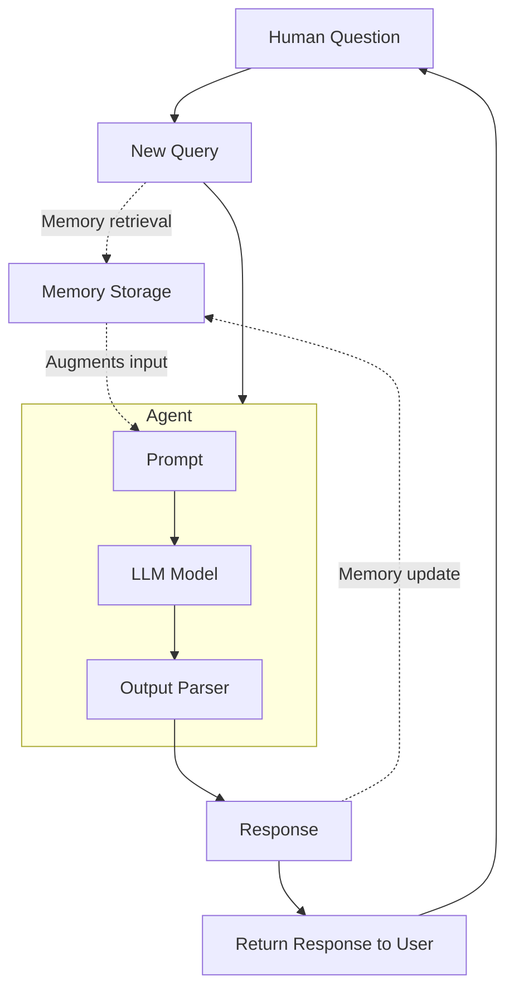

# Recipe 06 — Conversational Memory AI Agents

> Source: https://docs.sectors.app/recipes/generative-ai-python/06-memory-ai
> Author: Samuel Chan · October 16, 2024 (LangChain 0.3.2)
> Verified: 29 Aug 2026

## Goal

Give your ReAct agent a **memory** so multi-turn conversations feel coherent — "tell me more about the first company" works because the agent remembers the previous answer.

Two flavors:
1. **`RunnableWithMessageHistory`** (LCEL) — works with any chain, in-memory or persistent.
2. **`MemorySaver`** (LangGraph) — drop-in for `create_react_agent`, gives you checkpointing + thread IDs.

Critical for Track 1 agents that need to remember "the bank I asked about earlier."

---

## Architecture diagram



Two memory ops per turn:
1. **Read** before the LLM call → inject past turns into the prompt.
2. **Write** after the response → store the new turn.

---

## Inputs / outputs

| | Type |
|---|------|
| **Input** | A message + a `session_id` (LCEL) or `thread_id` (LangGraph) |
| **Output** | Same as the underlying chain — natural-language answer + updated memory |
| **Side effects** | Read-only on Sectors; write to in-memory dict or SQLite |

---

## Approach 1 — LCEL `RunnableWithMessageHistory` (newer, recommended)

### Setup

```bash
pip install langchain-community   # for SQLiteChatMessageHistory (optional)
```

### Build a chain with a `history` placeholder

```python
import os
from dotenv import load_dotenv

from langchain_groq import ChatGroq
from langchain_core.prompts import ChatPromptTemplate, MessagesPlaceholder

load_dotenv()
GROQ_API_KEY = os.getenv("GROQ_API_KEY")

llm = ChatGroq(model="openai/gpt-oss-120b", groq_api_key=GROQ_API_KEY)

prompt = ChatPromptTemplate.from_messages([
    ("system",
     "You're a financial stock advisor with adept knowledge of the Indonesian stock "
     "exchange (IDX) and adept at analysing, summarizing, inferring trends from "
     "financial information."),
    MessagesPlaceholder(variable_name="history"),
    ("human", "{question}"),
])

chain = prompt | llm
```

### Wrap with history

```python
from langchain_core.chat_history import InMemoryChatMessageHistory
from langchain_core.runnables.history import RunnableWithMessageHistory

store = {}

def get_session_history_by_id(session_id: str):
    if session_id not in store:
        store[session_id] = InMemoryChatMessageHistory()
    return store[session_id]

with_memory = RunnableWithMessageHistory(
    chain,
    get_session_history_by_id,
    input_messages_key="question",
    history_messages_key="history",
)
```

### Invoke

```python
out = with_memory.invoke(
    {"question": "What are some investable companies on the Indonesian stock market?"},
    config={"configurable": {"session_id": "supertype"}},
)
print(out.content)
```

Follow-up that **only works because of memory**:

```python
out2 = with_memory.invoke(
    {"question": "Tell me more about the first three companies on the list"},
    config={"configurable": {"session_id": "supertype"}},
)
```

The agent resolves "the first three" by reading `history` from the previous turn. **Switch `session_id` and the same prompt returns "I don't know which three you're referring to."**

---

## Approach 2 — Production: multi-user + persistent (SQLite)

For real apps you'll want per-user, per-conversation memory that survives a restart.

### Prompt with user context

```python
from langchain_core.runnables import ConfigurableFieldSpec

prompt = ChatPromptTemplate.from_messages([
    ("system",
     "You're a bilingual financial stock advisor with adept knowledge of IDX. "
     "Answer the user's queries with respect to his stock holdings. "
     "Answer in the {language} language, but be casual and not too overly formal. "
     "The user's holdings are: {holdings}"),
    MessagesPlaceholder(variable_name="history"),
    ("human", "{input}"),
])

chain = prompt | llm
```

### History factory with `user_id` + `conversation_id`

```python
from langchain_community.chat_message_histories import SQLChatMessageHistory

store = {}

def get_session_history_by_uid_and_convoid(user_id: str, conversation_id: str):
    key = f"{user_id}_{conversation_id}"
    # Swap InMemoryChatMessageHistory for SQLChatMessageHistory in production:
    # return SQLChatMessageHistory(key, "sqlite:///memory.db")
    if key not in store:
        store[key] = InMemoryChatMessageHistory()
    return store[key]

with_memory = RunnableWithMessageHistory(
    chain,
    get_session_history_by_uid_and_convoid,
    input_messages_key="input",
    history_messages_key="history",
    history_factory_config=[
        ConfigurableFieldSpec(
            id="user_id", annotation=str, name="User ID",
            description="Unique identifier for the user.", default="", is_shared=True,
        ),
        ConfigurableFieldSpec(
            id="conversation_id", annotation=str, name="Conversation ID",
            description="Unique identifier for the conversation.", default="", is_shared=True,
        ),
    ],
)
```

### Chat wrapper

```python
def chat(user_id: str, input: str, conversation_id: int = 1):
    holdings_db = {
        "001": ["BBCA", "ADRO", "BBRI", "GOTO"],
        "002": ["BBCA", "ADRO", "BBRI"],
    }
    prefs_db = {"001": {"language": "Bahasa Indonesia", "join_date": "2024-11-01"}}

    return with_memory.invoke(
        {
            "holdings": holdings_db.get(user_id, []),
            "language": prefs_db.get(user_id, {}).get("language", "English"),
            "input": input,
        },
        config={"configurable": {"user_id": user_id, "conversation_id": str(conversation_id)}},
    )

out = chat("001", "hi, my name is Sam. What stocks do i own?")
# → "Hai Sam! ... BBCA, ADRO, BBRI, GOTO"

out = chat("002", "hi, what did i say my name was?")
# → "You didn't mention your name..." (different user, separate memory)
```

### SQLite schema (auto-created)

```sql
CREATE TABLE message_store (
    id INTEGER PRIMARY KEY AUTOINCREMENT,
    session_id TEXT,
    message TEXT
);
```

---

## Approach 3 — Memory for `create_react_agent` (LangGraph)

If you're using LangGraph's prebuilt ReAct (recipe 05), `MemorySaver` is one line:

```python
from langgraph.checkpoint.memory import MemorySaver
from langgraph.prebuilt import create_react_agent

memory = MemorySaver()
app = create_react_agent(llm, tools, checkpointer=memory)

out = app.invoke(
    {"messages": [HumanMessage(content="Give me an overview of ADRO")]},
    config={"configurable": {"thread_id": "supertype"}},
)
print(out["messages"][-1].content)

# Follow-up uses the same thread_id to recall prior turns
out2 = app.invoke(
    {"messages": [HumanMessage(content="What was the daily close change?")]},
    config={"configurable": {"thread_id": "supertype"}},
)
```

`MemorySaver` is an in-memory checkpoint store (uses `defaultdict`). For production swap for `SqliteSaver` or `PostgresSaver`.

---

## Hackathon applicability

| Track | How to apply |
|-------|-------------|
| **AI Agents & Assistants** | **Mandatory.** A multi-turn chatbot that forgets prior context feels broken. Pick one of the three approaches above. |
| **Automation & Workflows** | Use **Approach 2** with SQLite memory so each daily digest run can remember yesterday's findings and emit "trend" alerts. |
| **Market Intelligence** | Thread-scoped memory lets you build a "watchlist conversation" — the user adds tickers, the agent remembers and monitors them. |

---

## Pitfalls

1. **`session_id`/`thread_id` is the ONLY memory key.** Two users sharing a `thread_id` see each other's history. Use UUIDs in production.
2. **`InMemoryChatMessageHistory` doesn't persist.** Server restart = memory loss. Use `SQLChatMessageHistory` (LCEL) or `SqliteSaver` (LangGraph) for anything real.
3. **Memory grows unbounded.** The default buffer keeps every turn. For long sessions use `ConversationSummaryMemory` (LLM-compressed summaries) or `ConversationBufferWindowMemory(k=N)` (last N turns only).
4. **Privacy.** Multi-tenant deployments need per-tenant encryption at rest. SQLite on disk is plain-text JSON.
5. **Tokens grow with turns.** A 50-turn conversation is a ~50× prompt. Budget for it.
6. **`MemorySaver` ≠ persistent.** It's in-memory. Same caveat as `InMemoryChatMessageHistory`.

---

## Quick TL;DR

- **Three approaches**, in order of modernness:
  1. `RunnableWithMessageHistory` (LCEL) — clean, in-memory by default.
  2. `SQLChatMessageHistory` — same shape, persists to disk.
  3. `MemorySaver` (LangGraph) — for `create_react_agent`, uses `thread_id`.
- **`session_id` / `thread_id` is the memory key** — share carefully.
- **No persistence** by default — add SQLite/Postgres for anything that survives a restart.

---

## See also

- [01-generative-ai-bg.md](./01-generative-ai-bg.md) — why RAG at all
- [02-tool-use-rag.md](./02-tool-use-rag.md) — the basic agent
- [03-multiagent.md](./03-multiagent.md) — multi-agent specialization
- [04-structured-output.md](./04-structured-output.md) — typed outputs across turns
- [05-react-conversational.md](./05-react-conversational.md) — LangGraph prebuilt ReAct + streaming
- [human-agent-framework.md](./human-agent-framework.md) — combine memory with a risk-profile input
