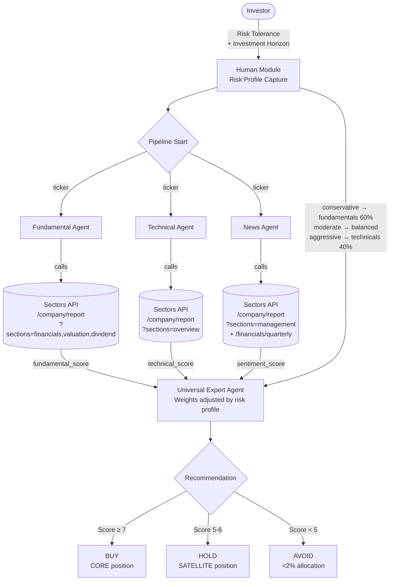

# Human-Agent Collaboration Framework for IDX Stock Analysis

> Source: <https://docs.sectors.app/recipes/sectors-for-ai-agents/04-human-agent>
> By: Alya Dwinanda · June 21, 2026
> Inspired by [FinArena](https://arxiv.org/abs/2503.02692) (Xu et al., 2025)

## The big idea

Most AI finance tools treat the user as passive. FinArena's Human-Agent Collaboration framework proposes the opposite: **the investor's risk profile shapes how specialist agents are weighted**. The same stock gets a different recommendation for a conservative vs. aggressive investor.

## Why this is hackathon-relevant

This is the cleanest end-to-end pattern for **AI Agents & Assistants track** because:

1. It satisfies the track's disqualification trap ("no off-the-shelf client with custom prompts") — every agent has its own prompt, tools, and responsibility.
2. It's deeply Sectors-core — three specialist agents each call different Sectors endpoints.
3. It demonstrates a *real* innovation over naive RAG: per-user signal weighting.
4. It's demo-friendly: same input, different risk profile, different output → judges can poke at it.

## Architecture

## The 4 specialist agents

### 1. Fundamental Agent
- **Tools:** `fetch-company-report(symbol, sections='financials,valuation,dividend')` via MCP
- **Output:** `fundamental_score` (0-10) based on P/E, margins, debt-to-equity, dividend track record
- **Uses more weight for:** conservative investors

### 2. Technical Agent
- **Tools:** `fetch-company-report(symbol, sections='overview')` (gets last_close_price, daily_close_change) + `fetch-listing-performance(symbol)` for 7d/30d/90d/365d price changes
- **Output:** `technical_score` (0-10) based on price position vs. trailing windows, momentum
- **Uses more weight for:** aggressive/growth investors

### 3. News Agent
- **Tools:** `fetch-news(symbol, start=..., end=...)` + `fetch-filings(symbol, ...)` for insider transactions + `fetch-companies-quarterly-financial-dates(since=...)` for freshness check
- **Output:** `sentiment_score` (0-10) based on earnings trajectory, recent news tone, insider activity
- **Uses Uncertainty-Driven Adaptive RAG** — only fetches additional data when LLM confidence is low

### 4. Universal Expert Agent
- **Tools:** None (synthesis only)
- **Input:** Three agent scores + risk profile weights
- **Output:** Final recommendation (BUY/HOLD/AVOID) + position size

## Risk profile weights

| Profile | Fundamentals | Technical | News/Sentiment |
|---|---|---|---|
| **Conservative** | 60% | 25% | 15% |
| **Moderate** | 40% | 35% | 25% |
| **Aggressive** | 25% | 40% | 35% |

Position sizing:
- Score ≥ 7 → CORE position (5-8% of portfolio)
- Score 5-6 → SATELLITE position (1-3%)
- Score < 5 → AVOID (<2% or zero)

## Hackathon applicability

This pattern wins the AI Agents track because it:
- Demonstrates multi-agent orchestration (3 specialist agents + 1 synthesizer)
- Uses Sectors API as a *core* dependency, not a decoration (loses function if Sectors goes down)
- Has clear production potential — risk-profile-aware recommendations beat one-size-fits-all
- Tells a compelling demo story: show same ticker, three different investor types, three different outputs

## Pitfalls

- **Latency** — 3 specialist agents in parallel + 1 synthesis = 20-40s typical. Cache per-ticker for 1h.
- **Cost** — each Sectors call = 1 credit. 3 specialist agents = 3 credits per query. Budget ~300 credits for ~100 queries during testing.
- **Score drift** — calibrate agent scores against historical outcomes (does score 7 → BUY actually correlate with forward returns?). Don't ship without backtesting.
- **Risk profile bias** — capturing risk tolerance upfront is tricky. Use a short questionnaire (5-7 questions) instead of asking users to self-classify.

## See also

- `references/recipes/03-multiagent.md` — base multi-agent pattern this builds on
- `references/mcp/setup.md` — fast path to wire the 3 specialist agents as MCP tool calls
- `references/cookbook/benchmark-banking.md` — IDX banking benchmark example using similar Sectors endpoints
