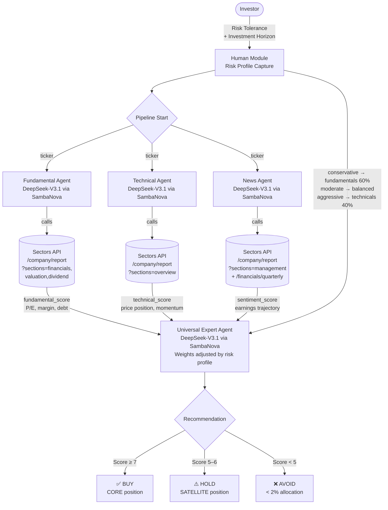

# Recipe — Human-Agent Collaboration Framework for IDX Stock Analysis

> Source: https://docs.sectors.app/recipes/sectors-for-ai-agents/04-human-agent
> Author: Alya Dwinanda (flytosevensky) · June 21, 2026
> Inspired by FinArena (Xu et al., 2025 — https://arxiv.org/abs/2503.02692)
> Verified: 29 Aug 2026

## Goal

Build an IDX stock analysis pipeline where **the investor's risk profile is an explicit input** to the reasoning process — not an afterthought. Same stock, same data, different investor → different recommendation. This is the most Track-1-aligned recipe in this repo.

> **The thesis:** Most AI financial tools treat the investor as passive — you ask, the model answers. Real investment decisions are deeply personal. A retiree managing capital preservation thinks very differently from a growth-oriented analyst willing to tolerate volatility. FinArena proposes routing data through specialist agents, then synthesizing their findings through the lens of *your* risk profile.

---

## Architecture diagram



**Five specialized agents in this recipe:**

| Agent | Tool(s) | Output |
|-------|---------|--------|
| **Human Module** | None — interactive prompt | `{risk_tolerance, horizon_years}` |
| **Fundamental Agent** | `fetch-company-report(sections=financials,valuation,dividend)` | `{fundamental_score: 1-10, ...}` |
| **Technical Agent** | `fetch-company-report(sections=overview)` | `{technical_score: 1-10, ...}` |
| **News Agent** | `fetch-company-report(sections=management)` + `fetch-quarterly-financials(n_quarters=4)` | `{sentiment_score: 1-10, ...}` |
| **Universal Expert Agent** | None — synthesizer | `{overall_score, recommendation, position_sizing, ...}` |

---

## Why FinArena? (vs. single-agent or generic multi-agent)

### Problem 1: Single-modality tools

Most AI stock tools pick one lane: price history (LSTM/ARIMA), news sentiment, or financial statements. Few do all three, fewer do it coordinated.

**FinArena's response:** specialist agents + a synthesizer. Same principle as Mixture-of-Experts (MoE) — a router dispatches to focused experts, each tuned for its slice.

In this IDX adaptation, Sectors API maps naturally to three lanes:
- Fundamentals → `/v2/company/report/{symbol}/?sections=financials,valuation,dividend`
- Technicals → `/v2/company/report/{symbol}/?sections=overview` (price, market_cap, daily change)
- News + sentiment → `/v2/company/report/{symbol}/?sections=management` + `/v2/company/quarterly-financials/{symbol}/?n_quarters=4`

### Problem 2: LLM hallucinations on news

A general LLM asked "What's the latest news on BBCA?" will confidently invent plausible events, especially for markets outside the US.

**FinArena's response:** *Uncertainty-Driven Adaptive RAG* — the news agent checks the LLM's confidence first; only when uncertain does it retrieve additional context. Less unnecessary fetching, but forces grounding on facts when it matters.

In this implementation: ground every claim in Sectors API data, never trust the LLM's training data for fresh news.

### Problem 3: AI frameworks ignore the investor

The paper calls this the *"Human-Machine confrontation"* mindset — most research optimizes for prediction accuracy on a benchmark, ignoring whether the result is a good decision *for this user*.

**FinArena's response:** the investor's risk preference isn't appended to the output — it's injected into the Expert Agent's prompt, *changing how it weights signals* before producing a recommendation.

| | Traditional | FinArena |
|---|-------------|----------|
| **Data** | Single modality | All three (specialist agents) |
| **Hallucination control** | None or static RAG | Adaptive RAG, only when uncertain |
| **Personalization** | One-size output | Risk profile shapes Expert Agent's reasoning |
| **Human role** | Passive recipient | Active collaborator who sets decision context |

---

## Inputs / outputs

| | Type |
|---|------|
| **Input** | (a) interactive risk profile (1/2/3 + horizon), (b) ticker list |
| **Output** | JSON recommendation per ticker: `{ticker, overall_score, recommendation, key_reasons, risk_warnings, position_sizing, summary}` |
| **Side effects** | Read-only — GET requests only |
| **Latency** | ~30–60s for 3 tickers (5 LLM calls × sequential agents, or 3 parallel + 1 expert) |

---

## Step-by-step code walkthrough

### Install + secrets

```bash
pip install requests nest_asyncio
```

Keys: `SECTORS_API_KEY` and `SAMBANOVA_API_KEY`. (For hackathon teams without SambaNova access, swap in `ChatGroq`, `ChatOpenAI`, or your local DeepSeek endpoint — the pattern is provider-agnostic.)

### Step 1 — Tools (one per Sectors endpoint)

```python
import json, requests
SECTORS_KEY = SECTORS_API_KEY
HEADERS = {"Authorization": SECTORS_KEY}
BASE = "https://api.sectors.app/v2"

def get_fundamentals(ticker: str) -> str:
    """Fetch financial statements + valuation metrics."""
    url = f"{BASE}/company/report/{ticker}/?sections=financials,valuation,dividend"
    resp = requests.get(url, headers=HEADERS)
    resp.raise_for_status()
    return json.dumps(resp.json())

def get_price_performance(ticker: str) -> str:
    """Fetch recent price + trading stats."""
    url = f"{BASE}/company/report/{ticker}/?sections=overview"
    resp = requests.get(url, headers=HEADERS)
    resp.raise_for_status()
    return json.dumps(resp.json())

def get_news_and_filings(ticker: str) -> str:
    """Fetch management + recent quarterly financials for sentiment."""
    url = f"{BASE}/company/report/{ticker}/?sections=management"
    resp = requests.get(url, headers=HEADERS)
    resp.raise_for_status()
    url_q = f"{BASE}/financials/quarterly/{ticker}/?n_quarters=4"
    resp_q = requests.get(url_q, headers=HEADERS)
    return json.dumps({
        "management": resp.json(),
        "quarterly_financials": resp_q.json() if resp_q.ok else {},
    })
```

### Step 2 — Generic agent runner with function calling

```python
import asyncio
from openai import AsyncOpenAI
from openai.types.chat import ChatCompletion

SAMBANOVA_BASE_URL = "https://api.sambanova.ai/v1"
SAMBANOVA_MODEL_NAME = "DeepSeek-V3.1"
SAMBANOVA_API_KEY = SAMBANOVA_API_KEY

client = AsyncOpenAI(base_url=SAMBANOVA_BASE_URL, api_key=SAMBANOVA_API_KEY)

async def run_agent(system_instruction: str, prompt: str, tools_map: dict = None) -> str:
    tool_map = tools_map or {}
    tool_defs = list(tool_map.values())
    messages = [
        {"role": "system", "content": system_instruction},
        {"role": "user", "content": prompt},
    ]

    for _ in range(10):
        kwargs = {"model": SAMBANOVA_MODEL_NAME, "messages": messages,
                  "temperature": 0, "stream": False}
        if tool_defs:
            kwargs["tools"] = tool_defs
            kwargs["tool_choice"] = "auto"
        resp = await client.chat.completions.create(**kwargs)
        msg = resp.choices[0].message

        if not msg.tool_calls:
            return msg.content or ""

        messages.append(msg)
        for tc in msg.tool_calls:
            fn = tool_map.get(tc.function.name)
            try:
                result = fn(**json.loads(tc.function.arguments))
            except Exception as e:
                result = f"Error: {e}"
            messages.append({"tool_call_id": tc.id, "role": "tool",
                             "name": tc.function.name, "content": result})

    return messages[-1].get("content", "Max tool-call rounds reached.")
```

> **Note:** the recipe's `run_agent` uses raw `requests` + `asyncio` to call SambaNova's OpenAI-compatible endpoint. For any provider with an OpenAI-compatible API (OpenAI, Groq, SambaNova, OpenRouter), swap the `SAMBANOVA_BASE_URL` / model name.

### Step 3 — Human module

```python
def get_risk_profile() -> dict:
    print("\n=== FinArena: IDX Investment Analysis ===")
    print("Before we begin, tell us about your investment profile.\n")
    print("Risk Tolerance:")
    print("  [1] Conservative — Capital preservation, low volatility, prefer dividends")
    print("  [2] Moderate     — Balanced growth and income, some volatility acceptable")
    print("  [3] Aggressive   — Maximum growth, high volatility acceptable\n")
    choice = input("Enter your risk tolerance (1/2/3): ").strip()
    risk_map = {"1": "conservative", "2": "moderate", "3": "aggressive"}
    horizon = input("Investment horizon in years (e.g. 1, 3, 5, 10): ").strip()
    print(f"\nProfile set: {risk_map.get(choice, 'moderate').upper()} investor, {horizon}-year horizon.\n")
    return {"risk_tolerance": risk_map.get(choice, "moderate"), "horizon_years": horizon}
```

### Step 4 — Three specialist agents

```python
TOOL_SCHEMAS = {
    "get_fundamentals": {
        "type": "function",
        "function": {
            "name": "get_fundamentals",
            "description": "Fetch financial statements + valuation metrics for an IDX ticker.",
            "parameters": {
                "type": "object",
                "properties": {"ticker": {"type": "string", "description": "Stock ticker (e.g. BBCA)"}},
                "required": ["ticker"],
            },
        },
    },
    "get_price_performance": {  # same shape, different name + description
        "type": "function",
        "function": {
            "name": "get_price_performance",
            "description": "Fetch recent price performance + trading statistics for an IDX ticker.",
            "parameters": {"type": "object", "properties": {"ticker": {"type": "string"}}, "required": ["ticker"]},
        },
    },
    "get_news_and_filings": {
        "type": "function",
        "function": {
            "name": "get_news_and_filings",
            "description": "Fetch recent news and corporate filings for an IDX ticker.",
            "parameters": {"type": "object", "properties": {"ticker": {"type": "string"}}, "required": ["ticker"]},
        },
    },
}

FUNDAMENTAL_INSTRUCTIONS = (
    "You are a fundamental equity analyst specializing in the Indonesia Stock Exchange (IDX). "
    "Use the get_fundamentals tool to retrieve financial data for the given ticker. "
    "Summarize: revenue trend, net profit margin, P/E ratio, P/B ratio, dividend yield, "
    "and debt-to-equity. Flag any red flags (negative margins, high leverage, etc). "
    "Output a JSON object with keys: ticker, revenue_trend, profitability, valuation, "
    "dividend_yield, leverage, red_flags, fundamental_score (1-10)."
)
TECHNICAL_INSTRUCTIONS = (
    "You are a technical analyst specializing in IDX price action. "
    "Use get_price_performance to retrieve price and market data for the given ticker. "
    "Analyze: 52-week price range position, market cap trend, beta (if available), "
    "and recent trading momentum. "
    "Output a JSON object with keys: ticker, price_position, momentum, market_cap, "
    "volatility_signal, technical_score (1-10)."
)
NEWS_INSTRUCTIONS = (
    "You are a news and sentiment analyst for IDX equities. "
    "Use get_news_and_filings to retrieve recent management info and quarterly financials. "
    "Look for: earnings trajectory (last 4 quarters), management changes, and any notable "
    "corporate actions. Assess whether momentum is positive, neutral, or negative. "
    "Output a JSON object with keys: ticker, earnings_trajectory, management_notes, "
    "corporate_actions, sentiment (positive/neutral/negative), sentiment_score (1-10)."
)
```

### Step 5 — Universal Expert Agent with risk-weighted prompt

```python
def build_expert_instructions(risk_profile: dict) -> str:
    risk = risk_profile["risk_tolerance"]
    horizon = risk_profile["horizon_years"]

    weight_instructions = {
        "conservative": (
            "Weight fundamentals (60%) > sentiment (25%) > technicals (15%). "
            "Prioritize dividend yield, low debt, and stable earnings over growth. "
            "Downgrade any stock with a fundamental_score below 6 or negative sentiment."
        ),
        "moderate": (
            "Weight fundamentals (40%) > technicals (35%) > sentiment (25%). "
            "Balance growth and income. Accept moderate volatility if fundamentals are strong."
        ),
        "aggressive": (
            "Weight technicals (40%) > fundamentals (35%) > sentiment (25%). "
            "Prioritize momentum and growth potential. Higher risk is acceptable for higher return."
        ),
    }

    return (
        f"You are a senior investment advisor synthesizing research for a {risk.upper()} investor "
        f"with a {horizon}-year horizon on the Indonesia Stock Exchange (IDX).\n\n"
        f"Weighting framework for this investor profile:\n{weight_instructions[risk]}\n\n"
        "You will receive three JSON reports: fundamental, technical, and sentiment analysis. "
        "Combine them into a final investment recommendation with:\n"
        "- Overall score (1-10)\n"
        "- Recommendation: BUY / HOLD / AVOID\n"
        "- Key reasons (3 bullet points)\n"
        "- Risk warnings specific to this investor's profile\n"
        "- Suggested position sizing: CORE (>5%), SATELLITE (2-5%), or AVOID (<2%)\n\n"
        "Format your output as clean JSON with keys: ticker, overall_score, recommendation, "
        "key_reasons, risk_warnings, position_sizing, summary."
    )
```

### Step 6 — Pipeline orchestration

```python
RECOMMENDATION_EMOJI = {"BUY": "✅", "HOLD": "⚠️", "AVOID": "❌"}

async def analyze_stock(ticker: str, risk_profile: dict) -> dict:
    print(f"\nAnalyzing {ticker}...")

    fundamental_result, technical_result, news_result = await asyncio.gather(
        run_agent(FUNDAMENTAL_INSTRUCTIONS, f"Analyze ticker: {ticker}", {"get_fundamentals": get_fundamentals}),
        run_agent(TECHNICAL_INSTRUCTIONS,   f"Analyze ticker: {ticker}", {"get_price_performance": get_price_performance}),
        run_agent(NEWS_INSTRUCTIONS,        f"Analyze ticker: {ticker}", {"get_news_and_filings": get_news_and_filings}),
    )
    print("  Fundamental: done | Technical: done | News: done")

    expert_instructions = build_expert_instructions(risk_profile)
    synthesis_prompt = (
        f"Ticker: {ticker}\n\n"
        f"=== FUNDAMENTAL REPORT ===\n{fundamental_result}\n\n"
        f"=== TECHNICAL REPORT ===\n{technical_result}\n\n"
        f"=== NEWS & SENTIMENT REPORT ===\n{news_result}\n\n"
        "Synthesize these three reports into your final recommendation."
    )
    expert_result = await run_agent(expert_instructions, synthesis_prompt)
    return json.loads(expert_result.strip().removeprefix("```json").removesuffix("```").strip())

async def main():
    risk_profile = get_risk_profile()
    watchlist = ["BBCA", "TLKM", "ASII"]

    recommendations = []
    for ticker in watchlist:
        recommendations.append(await analyze_stock(ticker, risk_profile))

    sorted_recs = sorted(recommendations, key=lambda x: x["overall_score"], reverse=True)
    for rec in sorted_recs:
        emoji = RECOMMENDATION_EMOJI.get(rec["recommendation"], "")
        print(f"{emoji} {rec['ticker']:5s}  score={rec['overall_score']}/10  "
              f"{rec['recommendation']:5s}  position={rec['position_sizing']}")
        print(f"    Reasons: {rec['key_reasons']}")
        print(f"    Warnings: {rec['risk_warnings']}\n")

# Run in Jupyter:
# await main()
```

---

## Sample output (BBCA / TLKM / ASII for a CONSERVATIVE investor)

| Ticker | Score | Recommendation | Position |
|--------|-------|----------------|----------|
| BBCA   | 8/10  | ✅ BUY         | CORE     |
| TLKM   | 6/10  | ⚠️ HOLD         | SATELLITE |
| ASII   | 6.5/10 | ⚠️ HOLD        | SATELLITE |

**BBCA rationale (truncated):**
- 51.4% net profit margin, 20.4% ROE, conservative leverage (D/E 4.6×) → stable 5.5% div yield.
- Largest IDX bank by market cap; capital adequacy 30.4%.
- **Risk warnings:** Premium valuation (P/B 3.0× vs peer avg 0.75×) may limit upside; LDR 75.9% approaching regulatory limits.

---

## Hackathon applicability

| Track | How to apply |
|-------|-------------|
| **AI Agents & Assistants** | **This is Track 1 gold.** Wrap in a CLI, Streamlit, or Telegram bot. Add a third input field ("watchlist CSV") and it becomes a real product. |
| **Automation & Workflows** | Schedule a daily `analyze_stock(...)` run on a 30-ticker watchlist and emit an email / Slack digest at 08:00 WIB. |
| **Market Intelligence** | The expert prompt *is* a market-intelligence generator. Persist all `recommendation` rows to SQLite for a daily-snapshot dashboard. |

---

## Pitfalls

1. **Don't ship the investor prompt as text.** Wire it into a UI form ("Risk tolerance: [Conservative|Moderate|Aggressive]") or CLI args — production needs typed input, not raw `input()`.
2. **Three specialists × N tickers = 3N LLM calls.** For 30-ticker watchlists that's ~90 calls. Cache per-ticker reports and re-synthesize the expert prompt when only the risk profile changes.
3. **Provider lock-in.** The recipe uses SambaNova's DeepSeek-V3.1, but the pattern works with any OpenAI-compatible endpoint. Swap `SAMBANOVA_BASE_URL` and the model name.
4. **Structured output is fragile.** The expert prompt asks for "clean JSON" — LLMs wrap in markdown fences ~30% of the time. The recipe's `.removeprefix("```json").removesuffix("```")` strips them, but a Pydantic validator (recipe 04) is the production-grade fix.
5. **Score thresholds (≥7 / 5–6 / <5) are arbitrary.** Tune against your historical accuracy. Treat the score as a *ranking*, not a literal classification.
6. **Position sizing is advice-shaped output.** Per hackathon rules §12 — *"Projects must not provide financial advice"* — frame the output as **information and analysis tools, not investment recommendations**. Include a disclaimer.
7. **Disclaimer:** this is a research demo, not production. Always add: *"This is not investment advice. Past performance does not guarantee future results. Do your own due diligence."*

---

## Quick TL;DR

- **The "human-in-the-loop" is the risk profile**, captured upfront and injected into the Expert Agent's prompt.
- **Three specialist agents** (Fundamental / Technical / News) each have one tool + one narrow job.
- **The Expert Agent** weights the three reports according to risk profile and emits BUY / HOLD / AVOID + position sizing.
- **Same ticker, different investor → different recommendation.** That's the entire differentiator vs. naive chatbots.

---

## See also

- [01-generative-ai-bg.md](./01-generative-ai-bg.md) — RAG motivation
- [02-tool-use-rag.md](./02-tool-use-rag.md) — single-agent baseline
- [03-multiagent.md](./03-multiagent.md) — multi-agent with judge-critic
- [04-structured-output.md](./04-structured-output.md) — Pydantic-validated outputs (recommended over recipe's manual JSON parsing)
- [05-react-conversational.md](./05-react-conversational.md) — streaming + LangGraph
- [06-memory-agents.md](./06-memory-agents.md) — multi-turn context for follow-up questions
- [`../mcp/setup.md`](../mcp/setup.md) — Sectors MCP setup (cloud-hosted)
- [`../mcp/tools.md`](../mcp/tools.md) — full 67-tool reference
